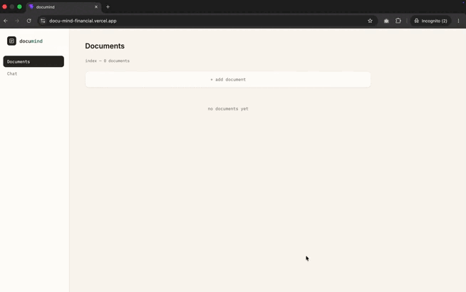
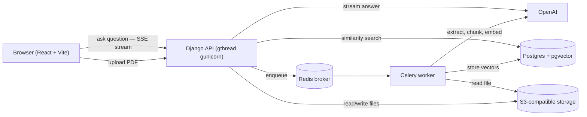

# DocuMind

Ask questions about your financial documents in plain English and get answers
grounded in the actual text — with page citations, not guesses. Upload an
invoice, statement, or receipt as a PDF; DocuMind extracts and embeds it, then
answers your questions via retrieval-augmented generation, streaming the
response token-by-token.



**Live demo:** [docu-mind-financial.vercel.app](https://docu-mind-financial.vercel.app/) ·
**API docs:** [`/api/docs/`](https://documind-web.up.railway.app/api/docs/) ·


## What it does

Most "chat with your documents" demos either hallucinate freely or hide their
sources. DocuMind retrieves the actual chunks it used, cites the page numbers
inline, and streams the answer live instead of making you wait for a full
completion — the pattern used in production LLM systems, built here directly
against the OpenAI and pgvector APIs rather than through a framework.

Uploads are scoped per browser session, so a public visitor only ever sees and
queries their own documents.

## Try it

1. Open the live demo (or run locally — see below).
2. Upload one of the ready-made PDFs in [`samples/`](samples/) (or your own).
3. Ask something like *"What's the total due on this invoice?"* or *"What was
   the closing balance?"* and watch the answer stream in with its source page.

## Architecture



- **Backend** — Django 4.2 / Django REST Framework, split-settings layout.
- **Async** — Celery worker (Redis broker) for PDF ingestion and embedding, so
  uploads return immediately and process in the background.
- **Vector store** — Postgres with the `pgvector` extension (cosine distance).
- **Media** — S3-compatible object storage shared by the web and worker.
- **Chat** — server-sent events (SSE) stream answers token-by-token.
- **Frontend** — React + Vite (`documind-frontend/`).

## Notable engineering decisions

Deliberate choices, each defensible in a sentence:

- **pgvector over a dedicated vector DB** (Pinecone/Weaviate/Chroma) — one fewer
  service to run, and a single Postgres instance is more than sufficient at this
  scale. Revisit only if retrieval volume outgrows one node.
- **SSE over WebSockets for streaming** — the token stream is one-directional
  (server → client) and short-lived. SSE is plain HTTP, needs no upgrade
  handshake, and reconnects for free; a bidirectional socket would be
  unjustified complexity.
- **Retries sit *before* streaming starts, not during** — the OpenAI call is
  retried (with backoff) while opening the stream, but once tokens are reaching
  the client a failure can't be silently retried without a visible gap or
  repeat. Mid-stream failures surface as a clean SSE `error` event instead.
- **No LangChain** — retrieval, prompt construction, and streaming are written
  directly against the OpenAI and pgvector APIs. At this scope a framework adds
  indirection without saving meaningful code.
- **Per-browser session scoping** — an `X-Session-Id` header (a
  `localStorage` UUID) isolates each visitor's documents. Isolation, not auth:
  the right lightweight boundary for a public demo.
- **Per-IP daily rate limit on chat** — a Redis daily counter caps the
  OpenAI-backed endpoint (`CHAT_DAILY_IP_LIMIT`, default 50) so a public URL
  can't run up the bill. Fails open if Redis is down.

## Testing

Coverage focuses on the service layer, not framework glue: chunking edge cases,
retrieval ranking and session scoping against known embeddings, prompt
construction, the retry boundary, rate-limit counting, and full request/response
integration tests with the OpenAI client mocked — so the suite runs with no API
key and no cost.

```bash
python manage.py test
```

## Settings

Settings are split into a package:

- `docuMind/settings/base.py` — shared config; safe defaults for local dev.
- `docuMind/settings/production.py` — `DEBUG=False`, secrets and hosts read from
  the environment (boot fails loudly if they're missing), object storage for
  media, WhiteNoise for static files, and HTTPS hardening (SSL redirect, HSTS,
  secure cookies).

Select with `DJANGO_SETTINGS_MODULE`:

```bash
export DJANGO_SETTINGS_MODULE=docuMind.settings.base        # local / CI (default)
export DJANGO_SETTINGS_MODULE=docuMind.settings.production  # production
```

See [`.env.example`](.env.example) for the full list of environment variables.

## Running the server

The chat endpoint streams responses over SSE, so the WSGI server **must not use
sync workers**. A streaming response holds its worker for the full duration of
the stream; with the default `sync` class, a handful of concurrent chat sessions
exhausts the worker pool and every other request blocks or times out. So it's a
deliberate, up-front choice here, not something to discover in production.

The `Procfile` uses `gthread` workers accordingly:

```
web: gunicorn docuMind.wsgi:application --worker-class=gthread --threads=4 --workers=2 --timeout=120 --bind 0.0.0.0:$PORT
worker: celery -A docuMind worker --loglevel=info --concurrency=2 --max-tasks-per-child=50
```

`gthread` (or `gevent`) lets a single worker hold many concurrent streaming
connections on separate threads instead of one connection monopolizing a process.
`--bind 0.0.0.0:$PORT` binds to the port the host injects (Railway/Render assign a
dynamic `$PORT`), rather than gunicorn's default 8000.

The Celery worker pins `--concurrency=2` because prefork otherwise forks one
process per CPU — on a 48-core host that's 48 copies of the app in memory, which
OOMs a small instance. `--max-tasks-per-child=50` recycles workers to reclaim any
memory creep from the PDF/embedding libraries.

## Local development

```bash
python -m venv .venv && source .venv/bin/activate
pip install -r requirements.txt          # runtime deps (pinned)
pip install -r requirements-dev.txt      # ruff, etc.

cp .env.example .env                      # then fill in values

# Postgres (with pgvector) + Redis are expected on localhost by default.
python manage.py migrate
python manage.py runserver                # + `celery -A docuMind worker` for processing
```

Frontend:

```bash
cd documind-frontend
cp .env.example .env                       # set VITE_API_URL
npm install && npm run dev
```

Before deploying, confirm the app boots under production settings:

```bash
DJANGO_SETTINGS_MODULE=docuMind.settings.production \
  SECRET_KEY=... ALLOWED_HOSTS=... CORS_ALLOWED_ORIGINS=... DATABASE_URL=... \
  python manage.py check --deploy
```

## CI

GitHub Actions (`.github/workflows/ci.yml`) runs on pushes and PRs to `main`:

- **lint** — `ruff` (backend) and `oxlint` (frontend)
- **test** — `python manage.py test` against Postgres/pgvector + Redis service containers
- **build** — frontend production build